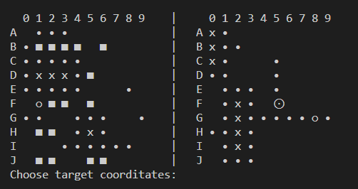

## Implementation of console [Battleship](https://en.wikipedia.org/wiki/Battleship_(game)) game in Python with a possibility of customization of board size, ships quantity and size.



### Interactions:
  - WASD - to move ship
  - R to rotate by 90 degrees
  - F to select position
  - Q to quit

## Running the application
  To run the app use
  ```
    pip install -r requirements.txt
    python main.py
  ```

## Tests
  To run test use `pytest`